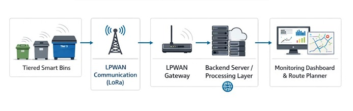
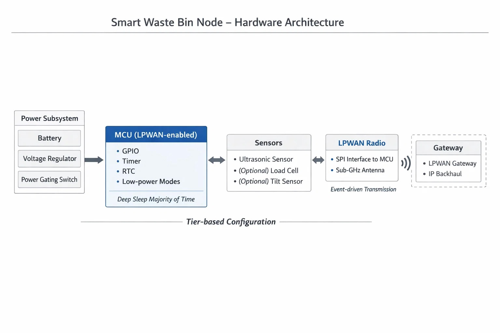
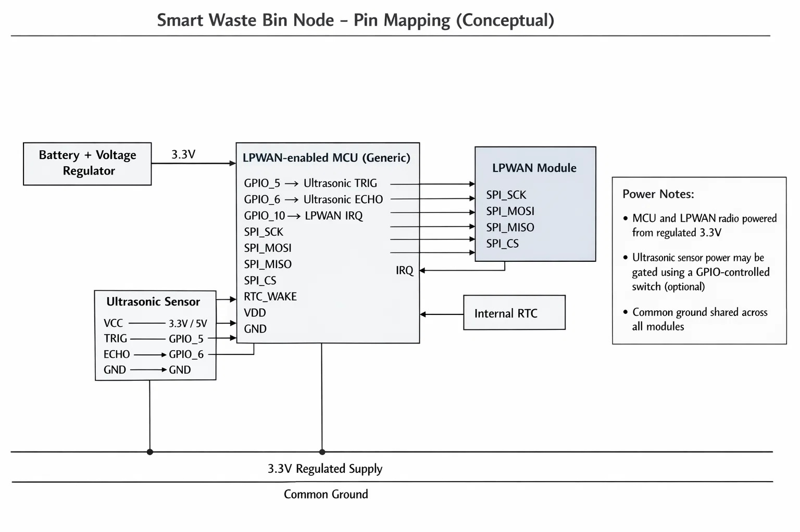

# Context-Aware Tiered Smart Waste Management System
**A virtual IoT architecture for scalable urban waste collection**

---

## Overview
Urban waste collection is inefficient when trucks follow static schedules: some bins overflow early while others are collected half-empty. This project proposes a **tier-aware smart waste bin network** that senses fill levels, publishes telemetry, flags near-full events, and feeds a **routing/priority engine** to generate optimized collection decisions.

**Core idea:** not every bin needs the same hardware, sampling rate, or network cost. Deploy bins in **tiers** (high-importance ↔ low-importance) and adapt sensing + reporting behavior accordingly.

---

## Key Design Goals
- **Scalable:** 100+ bins across multiple zones with predictable network load.
- **Reliable:** tolerant to sensor noise, node failures, and intermittent connectivity.
- **Power-aware:** battery-first design for bin nodes; tier-specific duty cycling.
- **Cost-feasible:** modular BOM with tier-based tradeoffs.

---

## System Architecture (End-to-End)
**Bin Node (Edge) → Gateway (LoRa/Multi-hop) → Backend (MQTT/HTTP) → Dashboard + Routing Engine**

<p align="center">
  
</p>
<p align="center"><em>Figure 1: End-to-end system architecture and data flow</em></p>

### Edge Node (Bin)
Typical components (tier-dependent):
- **Sensors:** ultrasonic (fill height), load cell/weight (validation), tilt (tamper/knockover)
- **MCU:** ESP32-class or ultra-low-power MCU (tier-dependent)
- **Comms:** LoRa for long range + low power; alternative links can be swapped per city constraints

### Gateway
- Aggregates node uplinks, performs light filtering / batching
- Bridges **LoRa → MQTT** (or HTTP) upstream to backend
- Handles buffering during backhaul outages

### Backend + Dashboard
- Ingestion service + state store (latest bin state, health, history)
- Routing engine for priority + route generation
- Dashboard for city ops: map view, alerts, analytics, truck assignments

---

## Data Flow
1. **Sense:** Bin node samples sensors based on tier schedule.
2. **Edge validation:** sanity checks + multi-sensor validation to reduce false readings.
3. **Publish:** node sends telemetry (periodic) and/or alerts (event-driven) to gateway.
4. **Ingest:** gateway forwards to backend via **MQTT** (preferred for pub/sub + QoS) or HTTP.
5. **Persist + compute:** backend updates bin state + triggers routing updates.
6. **Visualize:** dashboard renders fill levels, alerts, health, and recommended collections.

<p align="center">
  
</p>
<p align="center"><em>Figure 2: Sensor-to-backend data flow sequence</em></p>

---

## Route Optimization (Tier-Aware Priority)
Bins are ranked using a **priority score** computed from:
- Fill level & rate of change
- Tier weight (critical zones get higher priority)
- Time since last collection
- Bin health confidence (downweight noisy sensors / uncertain readings)
- Truck capacity and zone constraints

**Output:** ranked list of bins + route suggestion(s) per truck.

---

## Power Model (Tiered Duty Cycling)
Tiering enables aggressive power savings:
- **High tier:** higher sampling frequency, lower alert latency
- **Mid tier:** balanced periodic + event alerts
- **Low tier:** sparse sampling, batch reporting, event-only escalation near thresholds

Power optimization techniques (design-level):
- Deep sleep / wake-on-timer
- Sensor power gating
- Adaptive reporting (only transmit on meaningful delta)
- Local smoothing to prevent “chatty” uplinks

---

## Hardware Architecture
The internal hardware structure of a smart waste bin node is shown below.

<p align="center">
  
</p>
<p align="center"><em>Figure 3: Smart bin hardware block diagram</em></p>

---

## Pin Mapping
The pin-level interface between the MCU and peripherals is illustrated below.

<p align="center">
  
</p>
<p align="center"><em>Figure 4: MCU pin mapping for sensors and peripherals</em></p>

---

## Scalability & Network Considerations
Suggested topology:
- **Star-of-stars:** Bin nodes → Gateway(s) → Backend  

Protocol notes:
- **MQTT** is recommended for telemetry/alerts due to pub/sub structure and QoS options.
- **HTTP** can be used for simple integrations, but is less efficient for frequent device telemetry.

---

## Repository Structure

```text
WM-Aishwarya_Joshi-NMIT/
│
├── README.md
│
├── software/
│   ├── sensor_code/
│   │   └── ultrasonic_fill_level.c
│   │
│   └── software_architecture/
│       └── data_flow_diagram.jpeg
│
└── hardware/
    ├── hardware_architecture/
    │   └── block_diagram.jpeg
    │
    └── pin_diagram/
        └── bin_node_pin_mapping.jpeg 
```
## Author Details

**Name:** Aishwarya Joshi  
**Email:** aishwarya17.joshi@gmail.com  
**Institution:** Nitte Meenakshi Institute of Technology  
**Program:** B.E. in Electronics and Communication Engineering
